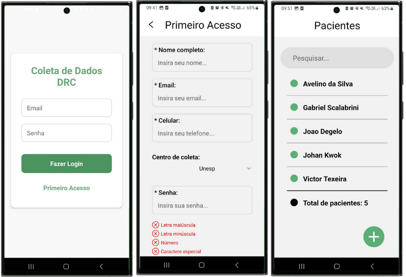
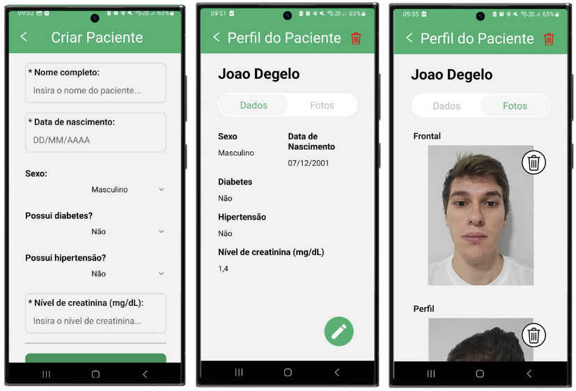
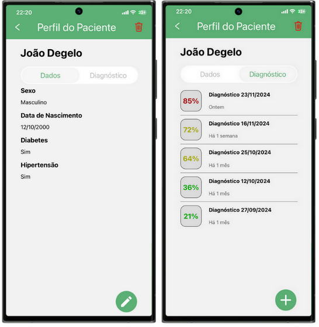
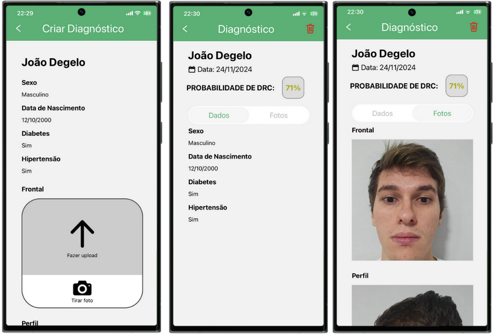

# Reconhecimento Facial para Detecção de Doença Renal Crônica

Projeto de Formatura da Escola Politécnica da USP: Reconhecimento Facial para Detecção de Doença Renal Crônica .

## Resumo

A Doença Renal Crônica (DRC) afeta um grande número de pessoas em todo o mundo. Considerando apenas o cenário brasileiro, estima-se que mais de 10 milhões de cidadãos brasileiros tenham DRC, com 90 mil em tratamento dialítico. Portanto, a DRC impacta a sociedade de duas maneiras: como problema de saúde pública e como problema econômico. Este trabalho propõe o desenvolvimento de uma solução baseada em inteligência artificial
utilizando imagens do paciente para auxiliar no diagnóstico de DRC. O projeto inclui o desenvolvimento de um aplicativo para a coleta de dados, além do desenvolvimento de um
sistema de diagnóstico contendo um aplicativo destinado aos profissionais de saúde. Para isso, foram treinandos modelos de aprendizado de máquina com informações demográficas, de saúde e imagens faciais e das mãos. A aplicação clínica da solução visa aumentar a eficiência no diagnóstico precoce da DRC, reduzindo o impacto da doença por meio de uma abordagem acessível e não invasiva.

## Contexto e Motivação

A doença renal crônica (DRC) é uma condição de longa duração que afeta os rins, órgãos responsáveis pela filtragem do sangue. No Brasil, os custos relacionados ao tratamento da DRC e de condições associadas representam 12,97% das despesas totais em saúde, evidenciando o impacto significativo dessa enfermidade na saúde pública.

A DRC não apenas compromete funções internas do organismo, mas também pode manifestar indicadores faciais nos indivíduos. Esse fenômeno abre portas para o uso de reconhecimento facial no apoio ao diagnóstico clínico. Nos últimos dez anos, o uso dessas tecnologias na medicina tem crescido de forma acelerada, oferecendo novas possibilidades para a identificação precoce de doenças como a DRC.

## Objetivos

- Criar um aplicativo que facilite o registro e a organização dos dados clínicos e fotos de pacientes, garantindo integridade e segurança dos dados.

- Projetar e treinar um modelo preditivo capaz de auxiliar médicos nefrologistas na identificação da DRC, contribuindo para a melhoria do tratamento e prognóstico dos pacientes.

## Desenvolvimento

Para o desenvolvimento dos sistemas, optou-se pela infraestrutura em nuvem da AWS, utilizando os serviços Lambda, API Gateway, DynamoDB, S3 e AWS Sagemaker. A escolha deles visa garantir uma arquitetura escalável e econômica, facilitando a comunicação entre os diversos componentes e assegura a qualidade na entrega do projeto. As figuras abaixo ilustram, respectivamente, as arquiteturas do aplicativo de coleta e do aplicativo de diagnóstico.

Os aplicativos foram desenvolvidos utilizando React Native com Expo Go, assegurando compatibilidade arquitetural multiplataforma e publicados na Google Play Store.

Para poder usar o aplicativo de coleta, é preciso inserir um token disponibilizado pelos pesquisadores no primeiro acesso. Após o login, o usuário é redirecionado à tela de lista de pacientes.

Ao clicar no botão de criar paciente, o usuário pode inserir informações do paciente, bem como as fotos do rosto e das mãos. Assim que o paciente é criado, o usuário é redirecionado à lista de pacientes. Ao clicar em um paciente, é possível visualizar seus dados e suas fotos, além de editar os dados ou substituir as fotos, se necessário.

O aplicativo de diagnóstico também possui o mesmo sistema de login, primeiro acesso, lista de pacientes e formulário de criação de pacientes. Porém, ao clicar em um paciente da lista, são mostrados seus dados e o histórico de diagnóstico, com a data e a porcentagem de o paciente ter DRC no diagnóstico.

Na aba de diagnósticos, é possível criar um novo diagnóstico, que utiliza os dados presentes, além das fotos do paciente no estado atual. Ao clicar em um dos diagnósticos da lista, é possível visualizar os dados e as fotos do diagnóstico.

Com relação às arquiteturas propostas para o modelo de IA, foram realizados testes com o algoritmo XGBoost e modelos pré-treinados de visão computacional. Adicionalmente, investigou-se a influência de diferentes inputs, explorando configurações como: utilização exclusiva de dados clínicos, incorporação de embeddings e variações nas imagens utilizadas para identificar os fatores responsáveis pelos melhores resultados.

## Resultados

O aplicativo de coleta de dados mostrou-se extremamente eficiente nessa fase, simplificando e agilizando significativamente o processo. Os usuários forneceram feedback positivo, destacando a interface intuitiva e a facilidade de uso.

Ao final do treinamento, o modelo desenvolvido apresentou desempenho superior ao baseline proposto. Contudo, a limitação do tamanho da base de dados restringe a validação estatística dessa melhoria. O próximo passo consiste na ampliação do conjunto de dados de modo a treinar um modelo mais robusto, capaz de extrair informações mais precisas e conclusivas das imagens.

## Autores

Integrantes:

- Gabriel Zambelli Scalabrini
- João Victor Texeira Degelo
- Johan Su Kwok

Orientadora:

- Profa. Dra. Anarosa Alves Franco Brandão - Departamento de Engenharia de Computação e Sistemas Digitais
  da Universidade de São Paulo (USP)

Coorientadores:

- Profa. Dra. Daniela Ponce - Faculdade de Medicina da Universidade Estadual Paulista (UNESP)
- Profa. Dra. Maristela Carvalho da Costa - Instituto do Coração HCFMUSP e Hospital Santa Catarina
- Prof. Rogerio da Hora Passos - Hospital Israelita Albert Einstein
